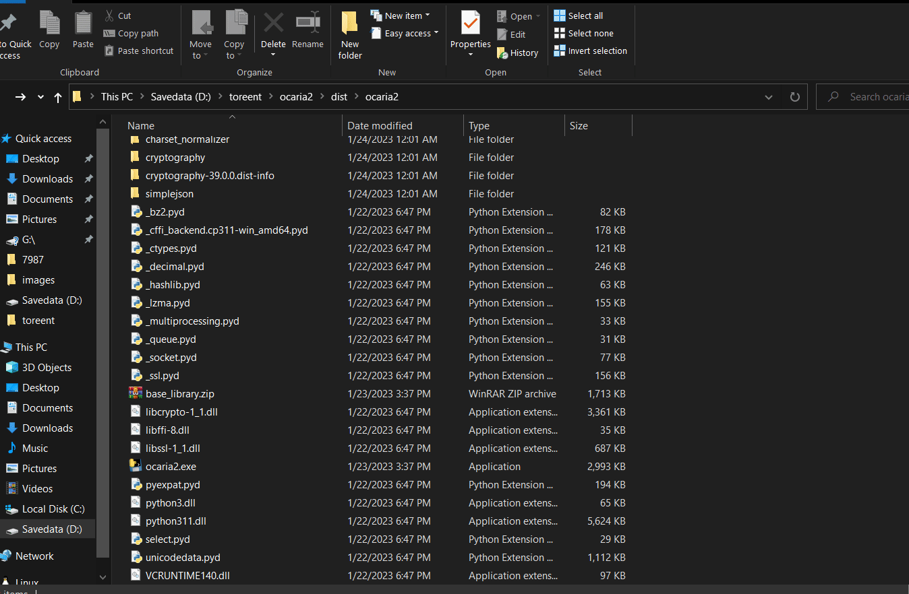

Run aria2c and AriaNgWke with one click. `ocaria2` will automatically get the trackers list and optimize the configurations for downloading any file via aria2c. 

## Installation
No need to install any dependency, just download ocaria2 from the [release](https://github.com/biplobsd/ocaria2/releases) and extract the zip file.

## Usages
Double-click the ocaria2.exe file to run aria2c and AriaNgWke together. Now you can use it for your downloading needs.

## Credit
- Aria2c
- AriaNgWke
- github.com/biplobsd